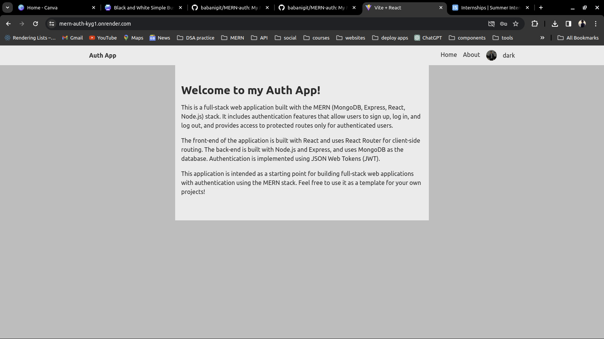

# MERN-auth

My MERN stack authentication app provides users with a robust platform for registering, logging in, and maintaining their profiles securely. It offers features like profile image upload and update capabilities, ensuring a personalized experience. Integration of Google login via Firebase authentication enhances convenience for users. Built using React.js, Node.js, Express.js, MongoDB Atlas, and Redux, the app emphasizes security through HTTPS, CSRF protection, data validation, and secure session management.

Deployed on Heroku and Netlify/Vercel, the application prioritizes scalability, availability, and reliability. It aims to deliver a seamless user experience while maintaining the highest standards of security and performance.

